# Single Cell Analysis with GUI

## Table of Contents

1. [Abstract](#abstract) 
2. [Methods](#methods)   
   1. [Dataset Selection](#dataset-selection)  
   2. [Interactive Filtering with GUI & Data Preprocessing](#interactive-filtering-and-preprocessing)  
        1. [Data Loading](#data-loading)  
        2. [Cell Filtering (Percentile-Based)](#cell-filtering)  
               1. [Gene Filtering (Cutoff-Based)](#gene-filtering)  
               2. [Normalization](#normalization)  
               3. [Saving the Filtered Data](#saving-filtered-data)  
  3. [Dimensionality Reduction](#dimensionality-reduction)  
      1. [PCA](#pca)  
  4. [Clustering Analysis](#clustering-analysis)  
      1. [ARS](#ars)  
  5. [Expression of Interesting Genes](#expression-of-genes)  
      1. [Discussion](#discussion)  
  6. [Software and Tools](#software-and-tools)  
      1.  [Programming](#programming)  
      2.  [Hardware Specifications](#hardware-specifications)  
  7. [Limitations and Feature Directions](#limitations)  
3. [Usage in Bioengineering (Experiment and Results)](#usage-in-bioengineering)  
  1. [Introduction](#introduction)  
  2. [Results](#results)  
4. [References](#references)  

---

## Program Related Part (Computer Science Related)

### Abstract

Patterns of gene expression differences can be identified by detecting variations in the levels of gene expression across different cell types, tissues, or conditions. These patterns provide insights into the unique molecular functions and identities of cells. For the convenience of the researchers, it would be simpler to use a desktop application with a user-friendly interface to do their analysis with just a few clicks instead of spending time on coding and finding the APIs to retrieve the data. In this project, Tabula Muris (Consortium et al., 2018) Single-cell RNA-seq data is used as a transcriptomic resource. By using this data, the aim of this project is to understand the gene expression differentiation process and, ultimately, to automate the analysis. 

### Methods

#### Dataset Selection

The dataset used in this analysis was obtained from the Tabula Muris project (Consortium et al., 2018), a collaborative effort to create a comprehensive single-cell transcriptomic atlas of mouse tissues. Specifically, we utilized the Single-cell RNA-seq data from Smart-seq2 sequencing of FACS sorted cells (v2) dataset which includes high-quality count matrices for individual cells, along with corresponding annotations and metadata (The Tabula Muris Consortium et al., 2018).  
For the purpose of convenience and organization, the project is structured into distinct directories to streamline data management and analysis. For a detailed view of the project’s directory structure, see Appendix (Figure 1).  

    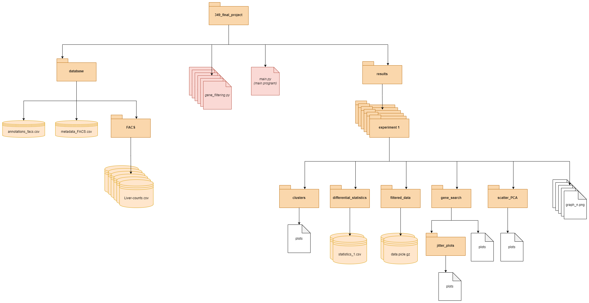

 
**Figure 1**: The directory structure of the project.

    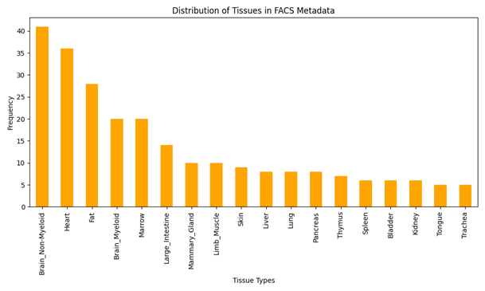

 
**Figure 2**: Distribution of different tissue types in the FACS dataset.

The root directory, 349_final_project, contains three main components: the database folder, the main.py script, and the results folder. The database folder includes essential reference files, such as annotations_facs.csv and metadata_FACS.csv, as well as the FACS subfolder, which stores tissue-specific count matrices like Liver-counts.csv. These files serve as the primary input data for analysis. The main.py script functions as the main program, orchestrating the preprocessing, analysis, and visualization of the scRNA-seq data. Results from the analysis are saved in the results  
directory, which is further organized into subfolders for each experiment. Each experiment folder contains output files, including graphs (e.g., graph_n.png), generated during the analysis.  
The dataset contains 18 different tissue types (see Appendix, Figure 2). To evaluate the performance of clustering and dimensionality reduction techniques, multiple experiments were conducted using different tissue combinations (see Results). These experiments aimed to compare the clustering results with the real labels provided in the annotation file. To be precise, two different scenarios were compared in the experiments:  
1-	Expected to be highly differentiated (e.g., bone marrow, thymus, and brain)  
2-	Expected to be less differentiated (e.g., liver, skin, lung, etc.)  

#### Interactive Filtering with GUI & Data Preprocessing

##### Data Loading

Data loading is handled using the `scprep` library. Count matrices are loaded from CSV files located in the database folder and organized by tissue type.

##### Cell Filtering (Percentile-Based)

With the help of the platform, we can see our adjustments directly on the screen. Two spin boxes were used to get the minimum and maximum percentiles. The depiction of the process with the screenshots taken from the real program can be seen below (see Figure 3, Figure 4, Figure 5).  
This approach ensures that the dataset retains cells with library sizes that fall within a representative and biologically meaningful range. The filtered dataset reduces noise and minimizes biases introduced by poor-quality or anomalous cells, enabling more accurate and reliable downstream analysis. By focusing on the bulk of the data (e.g., the middle 80% of cells), percentile-based filtering strikes a balance between preserving biological diversity and eliminating artifacts.  

    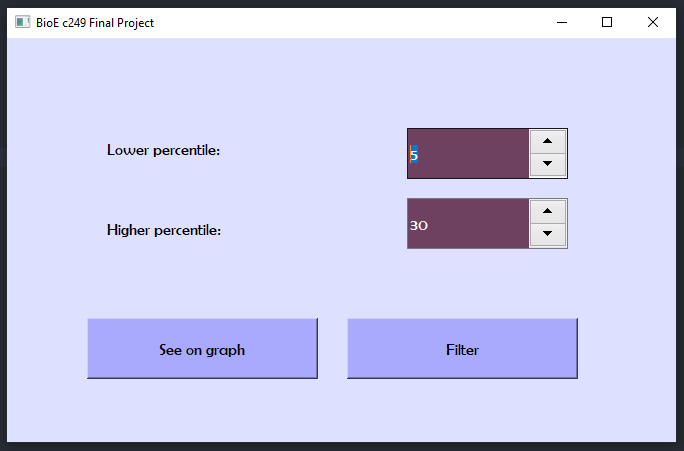

 
**Figure 3**: After the first percentile adjustment, click “see on graph” to see the interactive graph. Constraints: If a lower percentile becomes higher than the other, program automatically changes their values to avoid any error.

    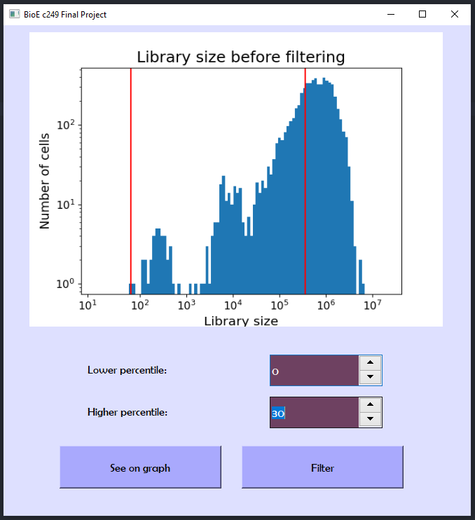

**Figure 4**: Whenever we change the percentiles and click “See on graph,” it will show us the percentile’s positions on the graph, which is important to filter out cells that are both significantly smaller than average and significantly larger than average.

    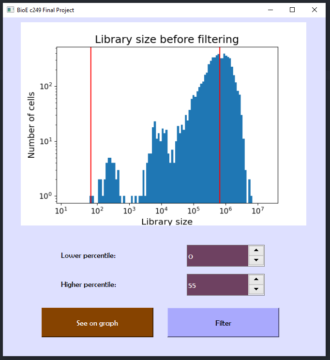

 
**Figure 5**: when the user click filter button, it saves the last adjusted percentiles and continue to the next step while saving the last graph to the associated experiment directory.

##### Gene Filtering (Cutoff-Based)

In single-cell RNA sequencing, not all genes are expressed in every cell, and some genes are expressed at such low levels that they are prone to dropout events where their expression is undetected due to technical noise. These lowly expressed genes, which may only be detected in a few cells, often lack sufficient data for meaningful analysis and can introduce noise into the dataset. The step-by-step description of the process with the screenshots taken from the real program can be seen below (see Figure 6, Figure 7, Figure 8).  

    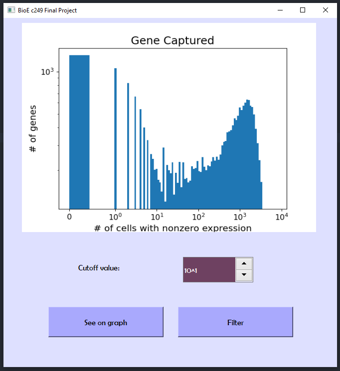

**Figure 6**: When the cell filtering is done, the program opens a interface for the gene filtering. The interface include interactive graph which shows the amount of genes that are captured. 

    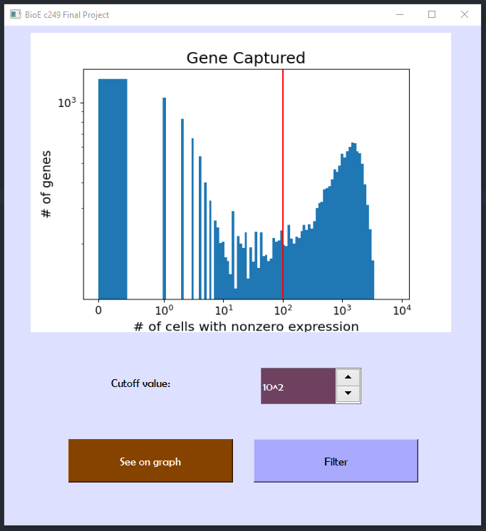

 
**Figure 7**: With the help of the user-friendly interface, user can easily find the best cutoff value. In order to see the cutoff on the graph, user should click “See on graph” after the adjustment.

    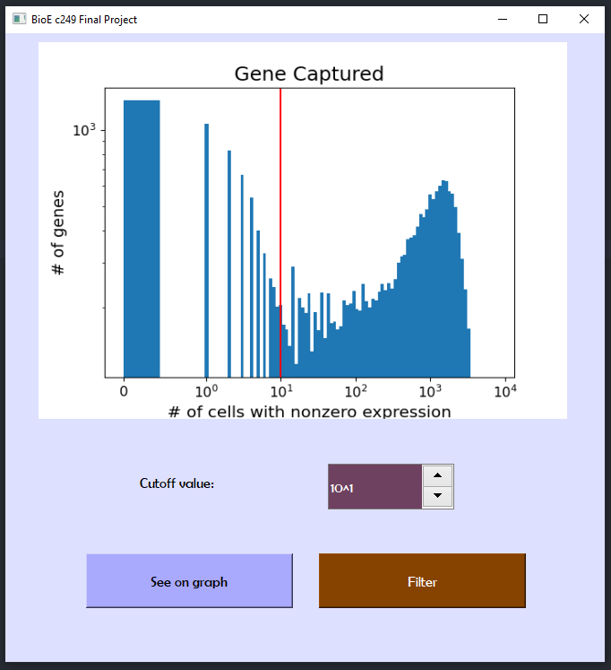

 
**Figure 8**: After deciding the best value (in this case it is 10), user can click “Filter” button to do the filteration with the adjusted cutoff value.

After filteration step is done, all graphs, including the amount of genes before and after the cutoff, are saved in the associated experiment’s directory.  

##### Normalization

Library size normalization in single-cell RNA sequencing adjusts for differences in sequencing depth between cells by scaling the total RNA counts in each cell to a uniform size. With the help of this step, we ensure that observed differences in gene expression are due to biological variations rather than technical artifacts like variable RNA capture efficiency. 
 
After normalization, the total library size for all cells becomes identical, preserving relative gene expression within each cell while enabling accurate comparisons across cells. This preprocessing is essential for reducing biases and ensuring reliable downstream analysis. 

##### Saving the Filtered Data

In the next step, the program saves the data frames into pickle.gz files in the associated experiment’s directory so that we can open them whenever it is required.

#### Dimensionality Reduction

##### Principal Component Analysis (PCA)

In biology, distinguishing gene expressions across different cells or tissues requires a technique to reduce the dimensionality of the data. This process eliminates unnecessary features that do not contribute to separating the cells. Dimensionality reduction not only simplifies the dataset but also enables effective visualization of the data. Given the thousands of features representing various aspects of the data, direct observation of distinctions becomes impractical. Visualization on a graph helps reveal these distinctions.  
PCA stands for principal component analysis, it is a dimensionality reduction technique that transforms high-dimensional data into a smaller number of principal components, which capture the most significant patterns or variations in the data. This allows for simplification and visualization of complex datasets while preserving their essential structure. So, it basically holds the most important features in the dataset, while eliminating the unnecessary ones. And it is doing that by looking at their variations. 
In this project, this step is initiated by the user entering the number of principal components that they want to generate (at least it should be 7, since we want to see the first 7 PCs). After receiving input from the user, the program calculates the principal components (PCs) and saves their corresponding graphs.
For example, in this test case (see Figure 9), 8 principal components were generated.  

    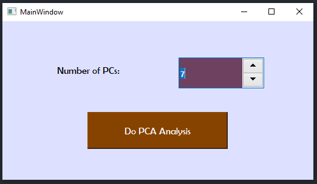

 
**Figure 9**: User selected 8 as the number of principal components that will be generated after the dimensionality reduction.

    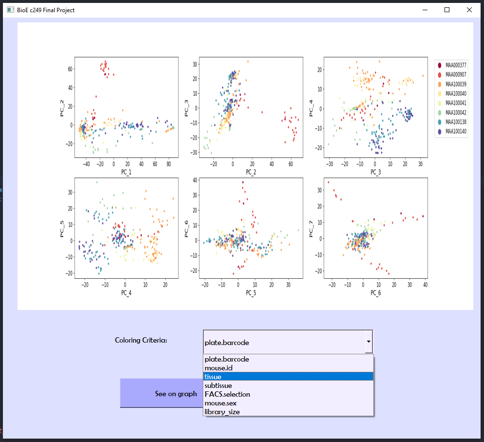

**Figure 10**: The interface which includes the graph with the coloring criteria, which can be helpful for researchers to look at different features’ effects interactively.

    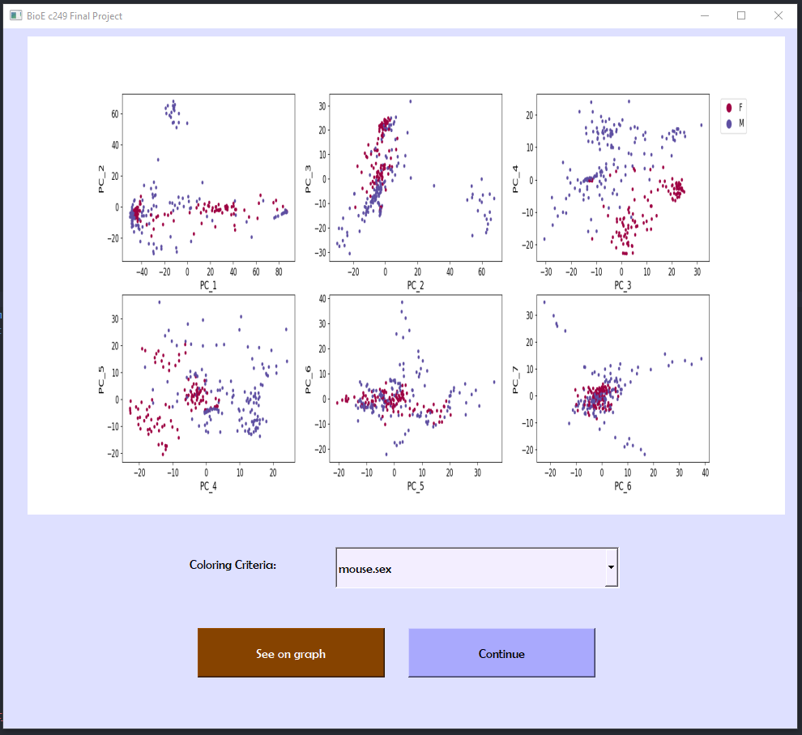

 
**Figure 11**: When the user changes the criteria, they can observe how each principal component (PC) emphasizes different factors. For instance, the first two PCs primarily focus on tissues and sub-tissues, while PCs four and five are more associated with the mouse's sex rather than tissue type. This is evident from the subplots in Figure 10: the first subplot effectively separates the tissues but does not distinguish sex, whereas the fourth subplot demonstrates the opposite pattern, clearly separating by sex. 

#### Clustering Analysis

For clustering, the researcher selects one of the algorithms from the clustering pool. Currently, there are five different algorithms that can be used: KMeans, Spectral, DBSCAN, Agglomerative and Phenograph. Each is analyzed in the results section in which different scenarios are tested, and their biological meaning is discussed. For an example, we will go through by selecting Brain Myleoid  
PhenoGraph is a graph-based clustering algorithm designed to identify distinct populations in high-dimensional datasets (Levine et al., 2015). The best thing about PhenoGraph is that it does not require prior knowledge about the number of clusters, making it ideal for exploratory genomics studies.  

    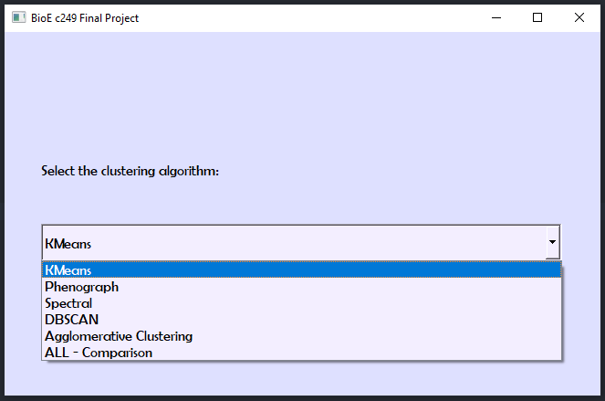

**Figure 12**: In the clustering panel, users can select which clustering algorithm they want to use in their analysis. They can also click 'ALL' to compare all clustering algorithms. To analyze clustering, we also click 'ALL'.

    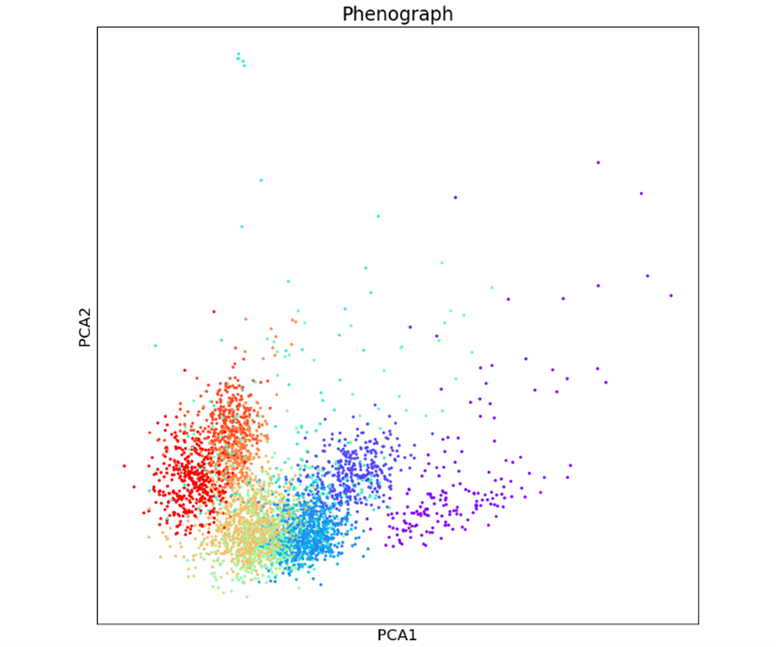

**Figure 13**: Clear differentiation between clusters suggests it captures finer details in cell heterogeneity. It likely provides the most granular insight into distinct myeloid subpopulations.

K-Means is a centroid-based clustering algorithm that partitions data into a predefined number of clusters (Gupta & Yerpude, 2018). That means that if KMeans is selected, researchers should give the possible number of clusters as an input. It divides cells into a predefined number of clusters by minimizing the distance between cells and cluster centroids. Since it assumes spherical clusters and equal variance, which may not hold in single-cell data.  

    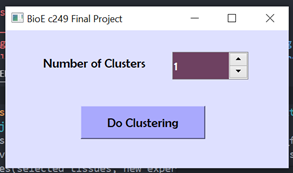

**Figure 14**: In KMeans clustering, the number of clusters should be given before the algorithm runs. It is also the same for Spectral, and Agglomerative clustering.

    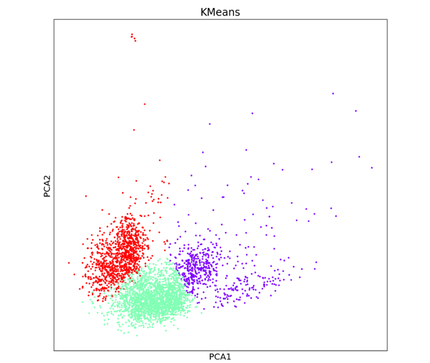

**Figure 15**: After KMeans with the number of clusters of three was selected, the clusters have been found. The program shows the graph and saves it in the corresponding cluster directory. KMeans works well for large, homogeneous cell populations but might oversimplify complex myeloid cell diversity. It can lead to less biological interpretability in highly heterogeneous datasets.

Spectral identifies clusters by capturing the structure of data in non-Euclidean spaces, making it effective for non-convex clusters.  

    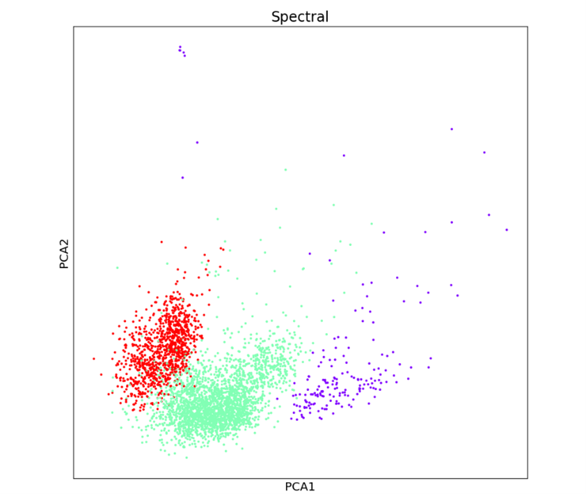

**Figure 16**: Spectral identifies myeloid subpopulations with strong separations in their profiles. However, it might not perform well for transitional states or noisy, irregular clusters.

DBSCAN is a popular clustering algorithm that groups together point that are close to each other based on density. Unlike methods like K-Means, DBSCAN can find clusters of varying shapes, including non-convex clusters.  

    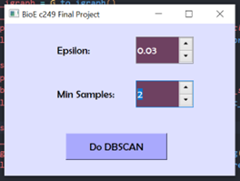

**Figure 17**: DBSCAN uses two main parameters: Epsilon (ε) and Minimum Samples. These parameters play crucial roles in determining how clusters are formed.

Epsilon defines the radius of a neighborhood around a data point. It determines how close other points must be to consider them as part of the same cluster. And, the minimum number of samples determines, at least, how many samples should be aggregated to be considered as a cluster.  

    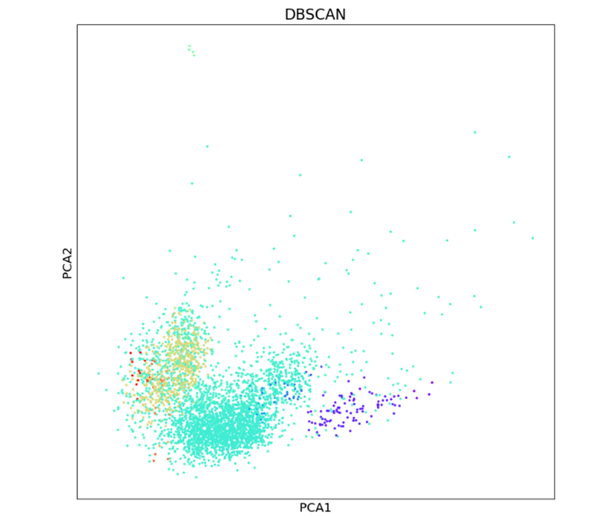

**Figure 18**: It can be seen that the algorithm struggles with elongated or irregularly shaped clusters due to its reliance on fixed density parameters (Epsilon and minimum points). Biologically, noise points could represent rare cell types, artifacts, or transitional states that don't fit well into the high-density clusters.

Agglomerative Learning is a type of hierarchical clustering that builds a hierarchy of clusters through a bottom-up approach.  

    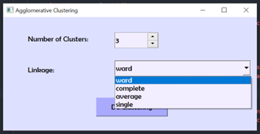

**Figure 19**: Number of clusters and linkage criteria should be given as parameters. Linkage determines how the distance between clusters is calculated. 

**Common linkage methods are**:
•	**Single Linkage**: The minimum distance between any two points in the clusters.
•	**Complete Linkage**: The maximum distance between any two points in the clusters.
•	**Average Linkage**: The average distance between all pairs of points in the two clusters.
•	**Ward’s Linkage**: Minimizes the variance of the clusters being merged.

    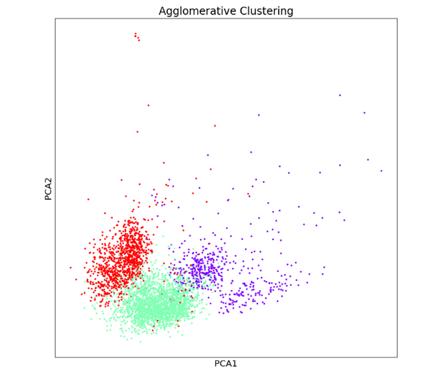

**Figure 20**: This approach could reveal hierarchical relationships among cell subpopulations, such as differentiation trajectories or lineage relationships.

##### Adjusted Rand Score (ARS)

It is a metric to evaluate the similarity between two clustering results. 
•	1.0: Indicates that the two clustering results are identical. All data points are grouped in exactly the same way.
•	Close to 0.0: Indicates that the clustering results are randomly assigned, showing minimal agreement between the two solutions.  
The researchers can see this comparison by clicking “All”, meaning that all algorithms will be executed. At the end, the program shows the ARS scores by the heatmap (see. Figure 20). KMeans and Agglomerative Clustering have the highest similarity, indicated by a strong red color (high ARS). This makes sense as both approaches tend to create compact and uniform clusters and may group data similarly when the data structure is relatively straightforward.  
Phenograph and Spectral Clustering show moderate similarity (lighter shades), which suggests that Phenograph and Spectral Clustering tend to identify subpopulations or structures similarly, likely focusing on local density and relationships. DBSCAN appears to have the lowest similarity with KMeans and Agglomerative, as shown by dark purple/black cells. This is expected since DBSCAN identifies clusters based on density and can detect irregularly shaped clusters or noise. Therefore, as a result of this execution, we can distinguish three distinct groups.  

    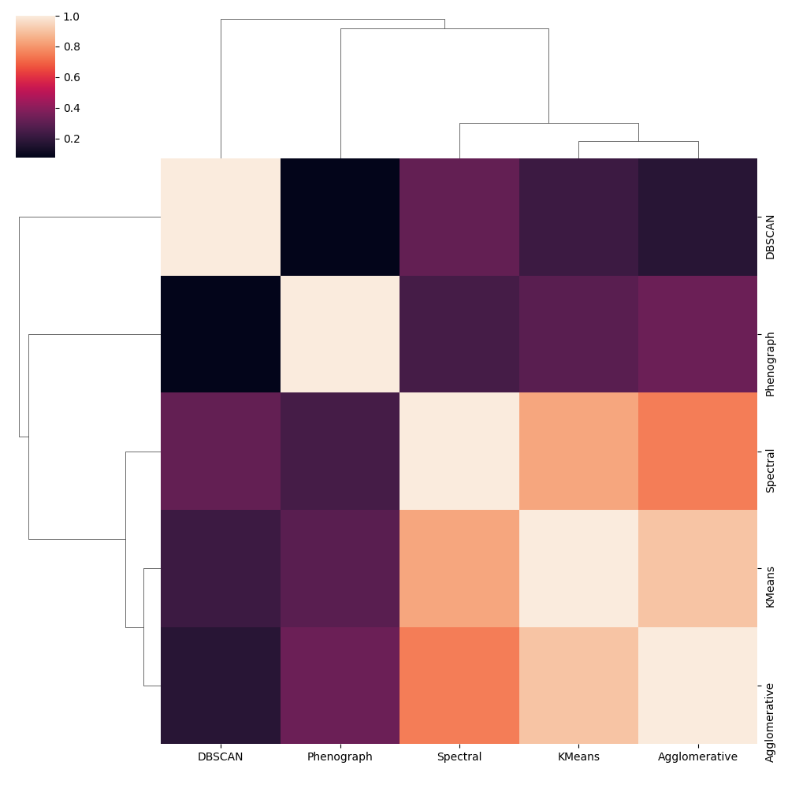

**Figure 21**: KMeans and Agglomerative seem to behave similarly and could be grouped together. Phenograph and Spectral Clustering also show moderate agreement, suggesting shared clustering characteristics. DBSCAN is an outlier as it differs the most from the others, reflecting its unique density-based approach. The program saves this figure in the clusters subdirectory which is the child of experiment directory.

#### Expression of Interesting Genes

    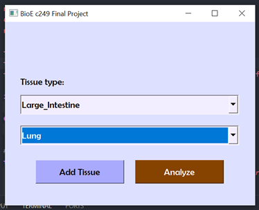

**Figure 22**: For this experiment, we selected large intestine and lung tissues to look gene expressions. 

The program finally allows us to look at the expression of the interesting genes on the data that has the reduced dimensionality after PCA.  

    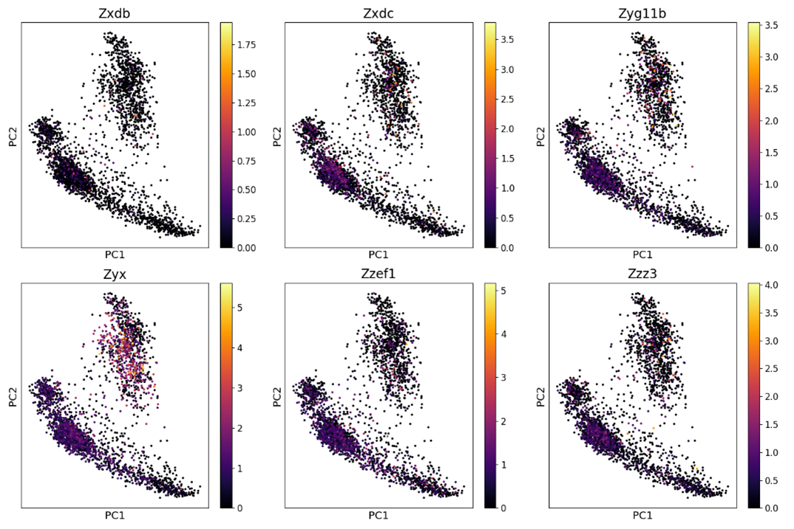

**Figure 23**: The PCA-reduced scatterplots suggest distinct clusters of cells, which likely represent biologically meaningful subpopulations. These clusters show differential gene expression patterns, as indicated by the color intensity for each gene.

The PCA plots show two major clusters: One at the top center. Another at the bottom-left. We can assume that these clusters represent cells from the lung and large intestine.  

##### Discussion
From figure 22, we can understand that genes like Zxdb, Zxdc, and Zzef1 show distinct enrichment in one of the clusters, indicating tissue-specific expression patterns. This suggests that these genes could play significant roles in distinguishing lung cells from intestinal cells.
On the other hand, genes such as Zyx and Zzz3 show a broader distribution across both clusters. These may represent genes involved in fundamental cellular processes shared between the tissues, such as structural maintenance or housekeeping functions.
It is likely that top-center cluster represents cells from lung tissue if genes specific to lung cells are enriched here. Let’s validate our assumption by searching for lung specific genes.
Ager, Nkx2-1, and Sftpc are supposed to be expressed in lung cells more. As we can see from figure 23, they are all expressed in lung cells distinctly. So, our hypothesis was true that the upper cluster indicates the lung cells.

    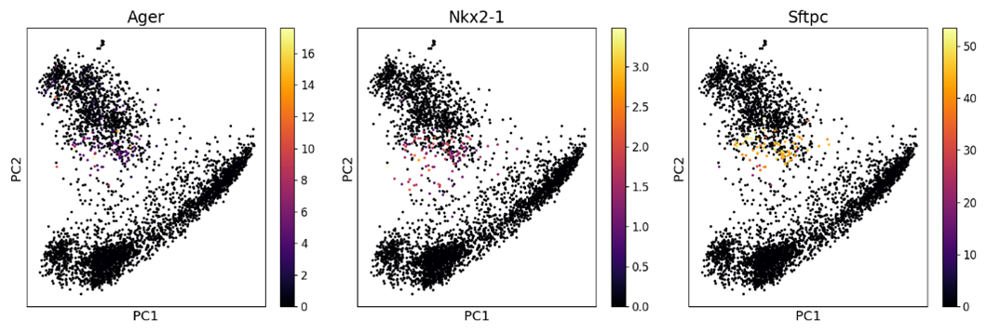

 
**Figure 24**: Ager, Nkx2-1 and Sftpc genes expressions level.

    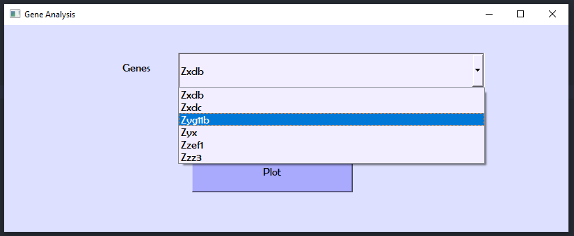

 
**Figure 25**: Select your favorite gene to see its dispersion among different classes.

    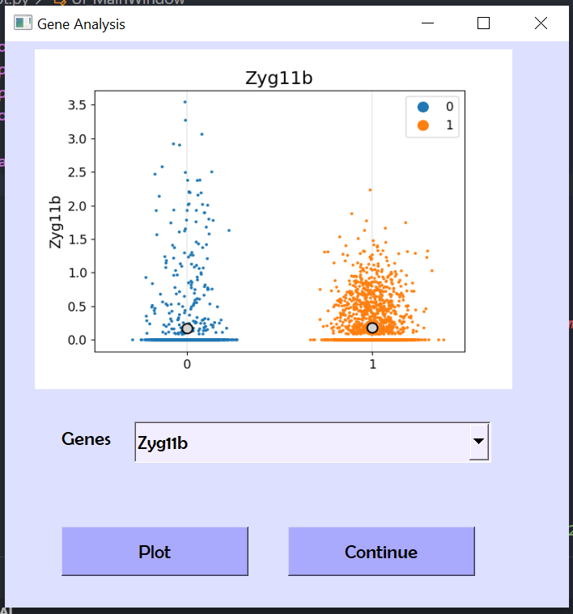

 
**Figure 26**: After selecting your first gene, you can see an interactive interface.

    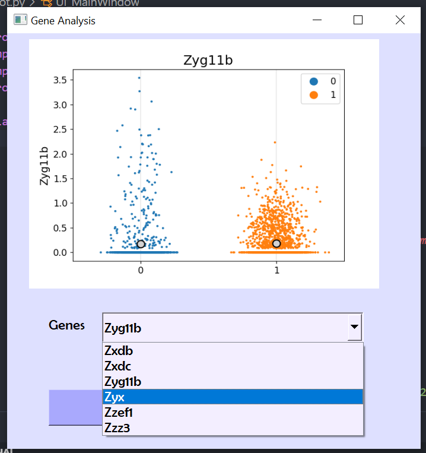

 
**Figure 27**: In this interface, you can change your favorite gene and see its dispersion accordingly. When you are ready you can continue to your analysis.

    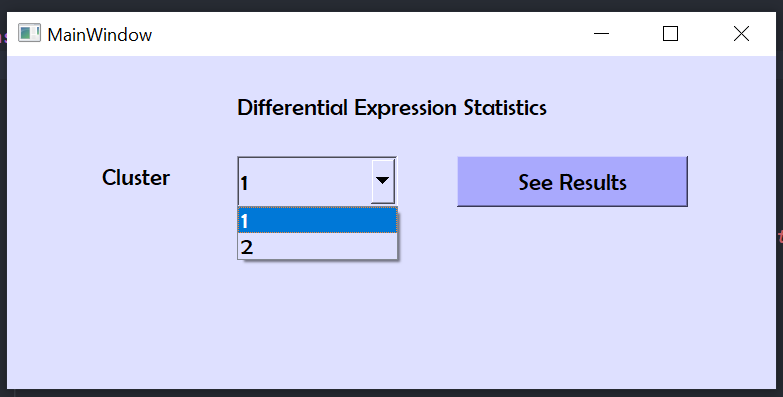

 
**Figure 28**: Next step is differential expression analysis. On the panel, you choose the class that you want to find its most differentially expressed genes.

    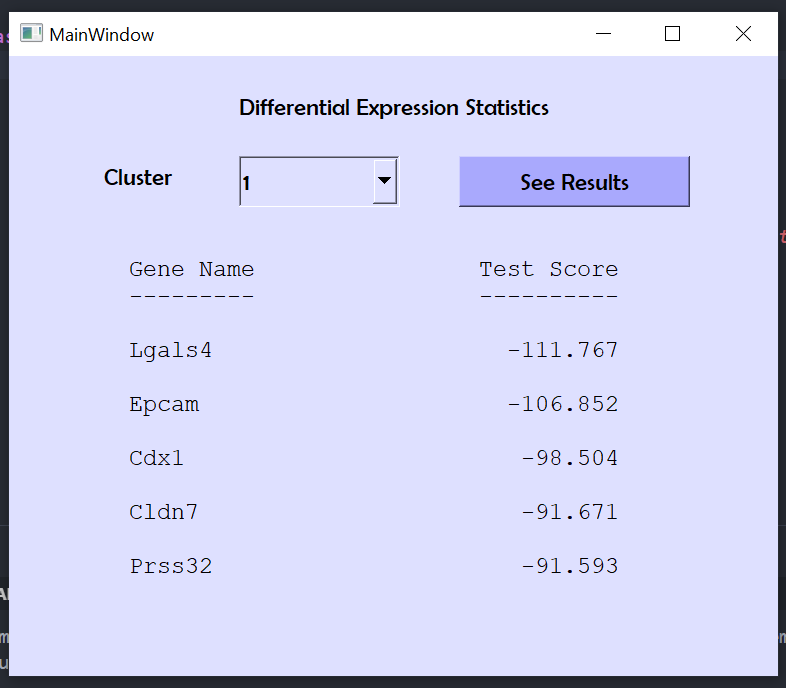

 
**Figure 29**: After clicking 'see results', you can see the top five most differentially expressed genes in this class. You can change your class from the combo box.

#### Software and Tools

##### Programming

Python version 3.9.6 has been used throughout the project. The main directory includes several components each has a unique goal. 

##### Hardware Specifications

The program can be executed directly on a local computer. It is written in Windows operating system.

### Limitations and Feature Directions

- **Connection to Online Databases**: In the scope of this project, the database and all directory structures had to be downloaded and organized according to the requirements (see Appendix, Figure 1). If there were a common hub, in which we can get our data online, such as NCBI database, it would be much more efficient and simpler to update the data afterwards (e.g., addition/deletion of new data).
- **Feature Correlation Panel**: Currently, since it is just a class project, the program cannot be able to show feature correlation. There can be a panel which shows the correlated features and the corresponding correlation value for each.  
Also, as a student who has a computer engineering background, it is extremely hard to understand the notation of genes (e.g., 0610007P22Rik). Program can give descriptions of the genes from the web (e.g., from NCBI) easily without forcing users to look at it on the web themselves. 

---

## Usage in Bioengineering (Experiment and Results)

### Introduction

This tool supports bioengineering research by simplifying scRNA-seq data analysis, allowing for efficient identification of cell types and gene expression patterns.

### Results

Results include:
- Cluster visualizations and ARS comparisons.
- Differential expression analyses.
- PCA plots highlighting tissue-specific gene expression.

---

## References

- Consortium, Tabula Muris; Webber, James; Batson, Joshua; Pisco, Angela (2018). Single-cell RNA-seq data from Smart-seq2 sequencing of FACS sorted cells (v2). Figshare. Dataset. https://doi.org/10.6084/m9.figshare.5829687.v8
- The Tabula Muris Consortium et al. (2018). Single-cell transcriptomics of 20 mouse organs creates a Tabula Muris. *Nature*, 562, 367–372. https://doi.org/10.1038/s41586-018-0590-4
- Gupta, G., & Yerpude, V. (2018). K – Means Algorithm. *International Journal of Research*, 5, 354-360.
- Levine, J.H., et al. (2015). Data-Driven Phenotypic Dissection of AML Reveals Progenitor-like Cells that Correlate with Prognosis. *Cell*, 162, 184-197.

---

## Thank you!
